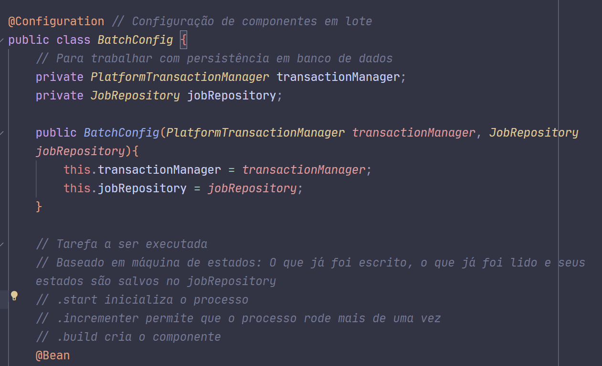

# Projeto CNAB

O seguinte projeto tem a intenção inicial de ler, processar e escrever em um banco de dados, arquivos CNAB, dos quais referenciam lojas com diversas características, das quais podem ser listadas, nome, dono, data, cartão, id e hora.

## Primeira etapa

Este projeto fora realizado em JAVA 21, utilizando como biblioteca o SpringBoot com as seguintes especificações: (i) H2 database, (ii) spring-boot-starter-test, (iii) spring-batch-test e (iv) spring-boot-starter-web.

## Segunda etapa

### Criação do BatchConfig.java

