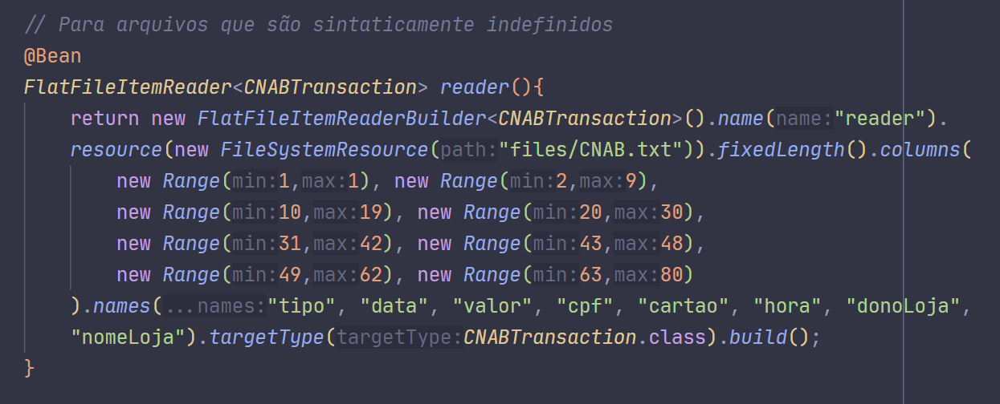

# Projeto CNAB

O seguinte projeto tem a intenção inicial de ler, processar e escrever em um banco de dados, arquivos CNAB, dos quais referenciam lojas com diversas características, das quais podem ser listadas, nome, dono, data, cartão, id e hora.

## Primeira etapa - Inicialização

Este projeto fora realizado em JAVA 21, utilizando como biblioteca o SpringBoot com as seguintes especificações: (i) H2 database, (ii) spring-boot-starter-test, (iii) spring-batch-test e (iv) spring-boot-starter-web.

## Segunda etapa - Escrita, processamento e leitura no banco de dados

### Criação do BatchConfig.java

Como a tarefa é realizada em lotes, uma "@configuration" se torna necessário para realizar os procedimento de leitura, processamento e escrita.

Nesta "@configuration", tal qual o XML, pode-se realizar a instância de "@bean" cujo o propósito é definir um método arbitrário que retorna um chamado a ser gerenciado pelo Spring, portanto, a escrita, leitura e processamento, devem ser instanciadas com "@bean".

Para a leitura, pode-se utilizar o tipo "FlatFileItemReader" pois o arquivo de extensão .txt é sintaticamente indefinido e assim, a configuração de colunas torna-se plausível.

O processamento converterá as Strings contidas no tipo "CNABTransaction" para os itens de "Transaction" que são os mesmos que constam no banco de dados.

Por fim, existe o processo de escrita que tratará da interconexão de dados entre os arquivos e a tabela. Nessa etapa cria-se o resource, schema.sql, para criação do banco de dados.

Note, para que a conexão aconteça de maneira correta é necessário inicializar o esquema e ainda prover a sua visualização.

## Terceira etapa - API

